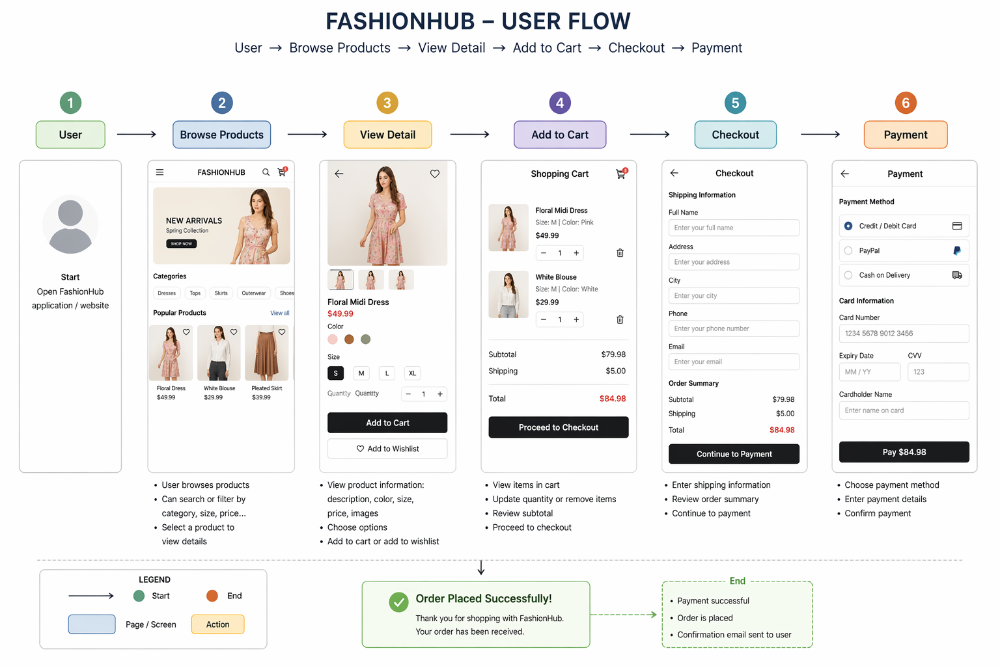
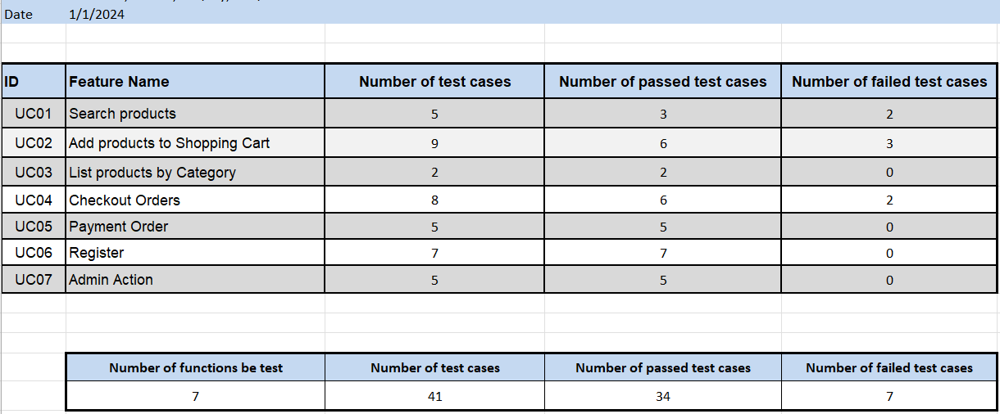

# FashionHub 👗 – E-commerce Web Application

## 📌 Project Overview

FashionHub is an e-commerce web application designed for selling women's clothing. The platform allows users to browse products, view detailed information, and complete purchases through an online shopping experience.

---
## 👤 My Role

* Business Analyst (BA)
* Test Management
* Contributed to Frontend Development and UI Design
* Prepared project documentation and reports

📌 Role Overview

This diagram summarizes my contributions across different aspects of the project, including analysis, testing, UI, and development support.

---

## 🧩 Key Responsibilities

* Analyzed and clarified business requirements

* Defined use cases and user flows for core system features

* Designed and managed test cases and test execution

* Led testing efforts and tracked test results

* Contributed to frontend implementation (UI components)

* Assisted in UI design for product-related pages

* Prepared project documentation including test reports and plans

* Collaborated with team members to ensure system quality and consistency

---

## 🛍️ Main Features

* Product listing with images and prices
* Product detail page (color, size, description)
* Shopping cart management
* User authentication (register, login)
* Wishlist (like products)
* Checkout and payment flow
* Admin management (products & users)

---

## 📄 Use Cases

| ID   | Name                 | Description                             |
| ---- | -------------------- | --------------------------------------- |
| UC01 | Search products      | Users can search for products           |
| UC02 | Add products to cart | Users can add products to shopping cart |
| UC03 | List by category     | Users can view products by category     |
| UC04 | Checkout             | Users enter shipping information        |
| UC05 | Payment              | Users complete payment                  |
| UC06 | Register/Login       | User account management                 |
| UC07 | Admin actions        | Manage products and users               |

---

## 🔄 User Flow

User → Browse Products → View Product Details → Add to Cart → Checkout → Payment

---

## 🧪 Testing

### Test Approach

* Functional testing for core features
* Positive and negative test cases
* Focus on end-to-end user flows

### Sample Test Case

**Test Case ID:** TC_UC02_01
**Feature:** Add to Cart

**Precondition:**

* User is logged in

**Steps:**

1. Navigate to product detail page
2. Select size and color
3. Click "Add to Cart"

**Expected Result:**

* Product is added to cart
* Cart quantity is updated

---

## 📊 Test Summary

### 🔍 Key Findings

* Some search results returned irrelevant products
* Validation issues when adding products without selecting options
* Checkout flow lacks proper error handling in certain cases

---

## 🐞 Bug Insights

* Missing validation for required product attributes (size, color)
* Inconsistent behavior in search functionality
* Potential issues when user performs actions without authentication

---

## ⚠️ Edge Cases Considered

* Add to cart without login
* Checkout with empty cart
* Invalid input during payment

---

## 📈 Lessons Learned

* Importance of clear and detailed requirements
* Identifying edge cases early improves system quality
* Close collaboration between BA, QA, and developers is critical

---

## ⚠️ Current Limitations

* The application is currently only runnable in a local environment (localhost)
* No deployment or hosting solution has been implemented
* Limited accessibility for external users and stakeholders
* Some features may not be fully tested in a production-like environment

---

## 🚀 Future Improvements

* Deploy the application to a public hosting platform (e.g., Vercel, Render, or AWS)
* Improve system accessibility for real users
* Enhance testing coverage in a production environment
* Implement better error handling and validation
* Optimize user experience and interface design

